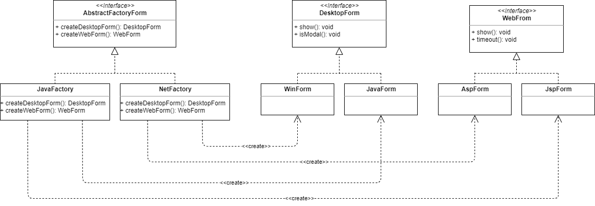

# Patrón de Diseño - Abstract Factory

## Intención 
_Patron de diseño que provee una interfaz para crear familias de objetos relacionados o dependientes si especificar su clase concreta._

## Aplicabilidad
* Utilice Abstract Factory cuando su código necesite funcionar con varias familias de productos relacionados, pero no desee que dependa de las clases concretas de esos productos; es posible que no se conozcan de antemano o simplemente desee permitir una futura extensibilidad.

* Considere implementar Abstract Factory cuando tenga una clase con un conjunto de métodos de fábrica que difuminen su responsabilidad principal.

* En un programa bien diseñado, cada clase es responsable solo de una cosa. Cuando una clase se ocupa de varios tipos de productos, puede valer la pena extraer sus métodos de fábrica en una clase de fábrica independiente o en una implementación completa de Abstract Factory.

## Estructura

## Resumen Abstract Factory
* Busca agrupar un conjunto de clases que tiene un funcionamiento en común llamadas familias, las cuales son creadas mediante un Factory.

* Este patrón es especialmente útil cuando requerimos tener ciertas familias de clases para resolver un problema

##  Problema
En una aplicacion se deben crear dos  tipos de familias de formularios : Desktop y Web, para distintos frameworks de desarrollo, inicialmente para Net y Java.
Todos los formularios tienen el metodo Show() en comun, mientras que los Desktop agregan un metodo IsModal() y los Web un Timeout().
En el caso de Net, los forms web se denominan AspForm y desktop WinForm. Para Java, los web son JspForm y desktop JavaForm.

Generar un diseño compatible con el patrón AF para este problema (diag. de clases y codigo cliente para testearlo: crear un JspForm y ejecutar Show())

## Diagrama de Clase 

