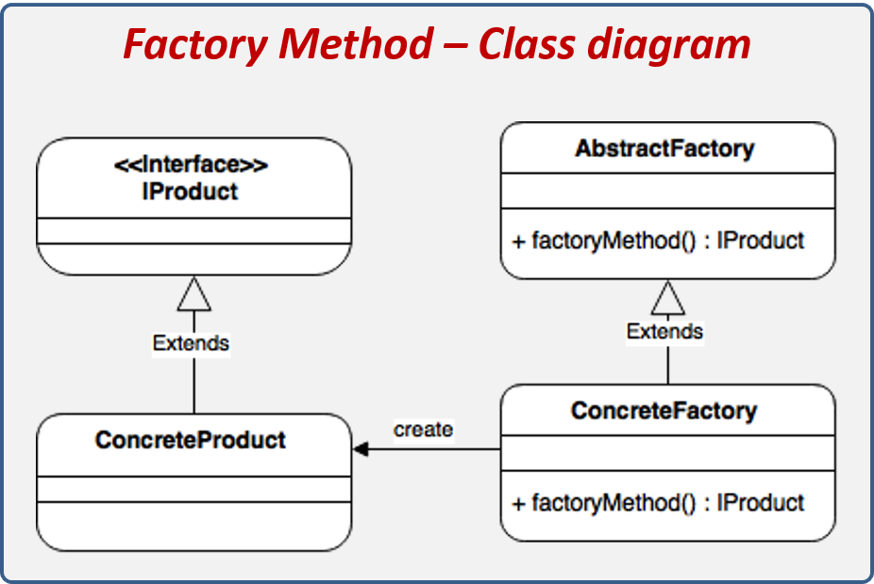
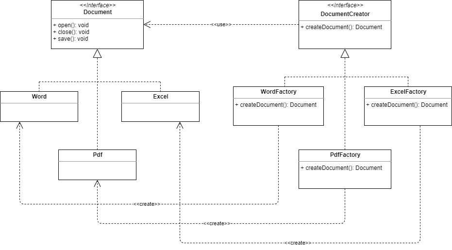

# Patrón de Diseño - Factory Method

## Intención 
_Factory Method es un patrón de diseño de creación que proporciona una interfaz para crear objetos en una superclase, pero permite que las subclases alteren el tipo de objetos que se crearán._

## Aplicabilidad
Utilice el patrón Factory Method cuando:

* La clase no puede anticipar la clase de objetos que debe crear.
* La clase quiere que sus subclases especifiquen los objetos que crea.
* Las clases delegan la responsabilidad a una de las varias subclases de ayudantes, y desea localizar el conocimiento de qué subclase de ayudantes es el delegado.

## Estructura

## Resumen Factory Method

* Permite la creación de un subtipo determinado por medio de una clase de Factoría, la cual oculta los detalles de creación del objeto.
* El objeto real creado es enmascarado detrás de una interface común entre todos los objetos que pueden ser creados, con la finalidad de que estos pueden variar sin afectar la forma en que el cliente interactúa con ellos. 
* Es normal que un Factory pueda crear varios subtipos de una determinada interface y que todos los objetos concretos fabricados hagan una tarea similar pero con detalles de implementación diferentes. 

##  Problema

En una aplicación se deben crear distintos formatos de documentos, inicialmente: Word, Pdf, Excel. 
El comportamiento en común es Abrir, Cerrar y Grabar.

Generar un diseño compatible con el patrón FM para este problema (diag. de clases y codigo cliente para testearlo: crear un documento Word y abrirlo )

## Diagrama de Clase 

