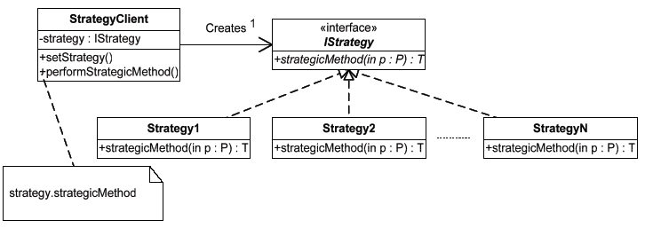
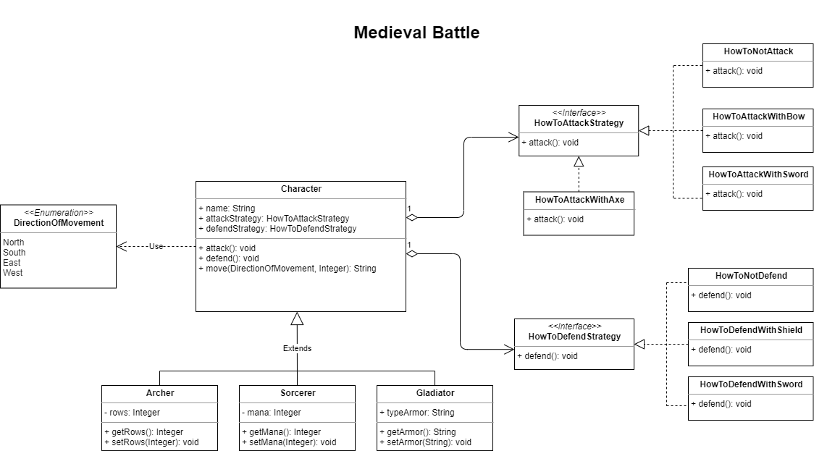

# Patrón de Diseño - Strategy

_Una relacion TIENE UN puede ser mejor que ES UN._

## Intención 

_Estructurar una familia de algoritmos de modo que sus clientes puedan intercambiarlos en tiempo de ejecución_

## Aplicabilidad

* Se necesitan variantes de un mismo algoritmo.
* Compresión de archivos en múltiples formatos.
* Diferentes mecanismos de autenticación.
* Se desea que las estructuras de datos de cada algoritmo sean transparentes para el cliente.

## Estructura

* **IStrategy** - *declara una interfaz común para todos las variantes de un algoritmo*
* **Strategy X** - *implementa una variante del algoritmo*
* **Strategy Client** - *es el responsable de crear y mantener una referencia a una estrategia concreta*

## Resumen Strategy

* Factoriza aspectos comunes de una familia de algoritmos y permite utilizarlos en las clases base de la jerarquía
* Aumenta cohesión del cliente
* Sistematiza el uso de implementaciones alternativas
* El cliente es el responsable de crear estrategias, por tanto debe comprender las posibilidades que ofrecen, esto es, debe ser relevante para el contexto del cliente

* Menor eficiencia. Aumenta el número de objetos creados

##  Problema

Para un juego de guerra medieval, se deben crear 3 tipos de roles: Arquero, Mago y Gladiador. 
Cada personaje puede: atacar, defender y mover(direccion, velocidad). 
En los acciones de atacar/defender estarán las rutinas de cómo (HowTo) proceder a esas acciones con distintas armas, las cuales podrán variar mas adelante. O sea que habra un ‘ComoAtacarEspada’ , ‘ComoAtacarHacha’, ‘ComoDefenderEscudo’, ‘ComoDefenderArco’, etc. Hay armas que sirven para ambas acciones (Espada) y otras no (Escudo-Defensa) 

Inicialmente el jugador tendra un arma para atacar y otra para defenderse, junto con el HowTo respectivo a esas armas. Luego, a medida que avance en el juego podra encontrar otras armas con las cuales reemplazar las existentes (* al levantar la nueva arma se incorpora al jugador el nuevo HowTo de la misma). Puede darse el caso de no tener como atacar y/o defenderse.

_Test: Crear un Gladiador que posea una espada para atacar y defender, avance 3 casillas al Sur y allí encuentra un Hacha solo para Atacar que reemplazará a la Espada_

## Diagrama de Clase 

